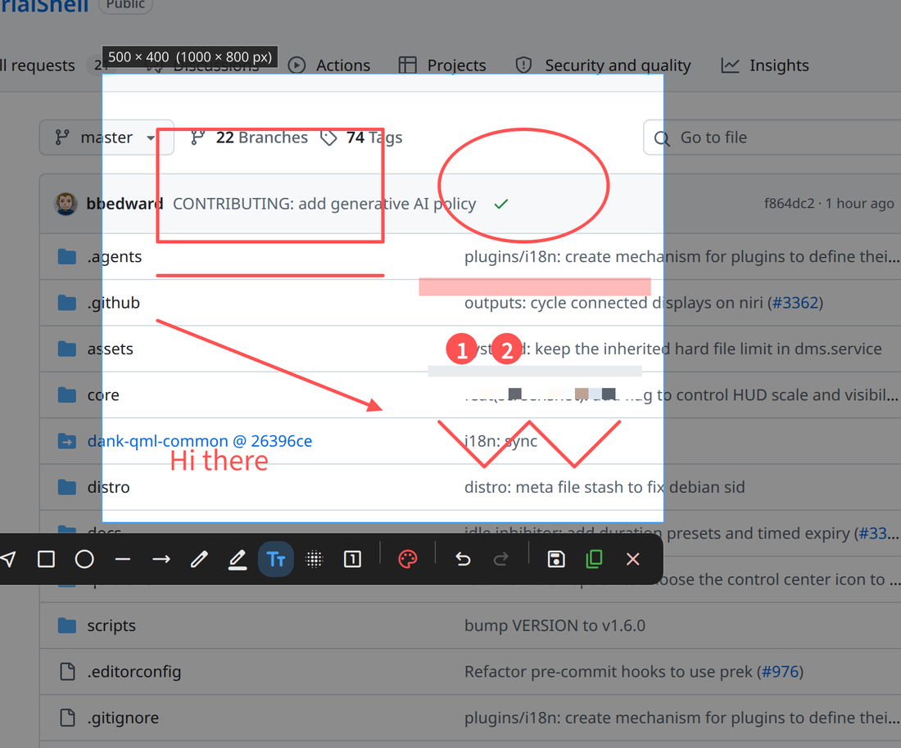

# Screenshot+

A [DankMaterialShell](https://github.com/AvengeMedia/DankMaterialShell) plugin for region screenshots with live annotation.

Drag out a selection, and the toolbar appears next to it. Draw on the picture right there, then move or resize the selection at any time: annotations stay anchored to the picture, and the toolbar follows the selection. No second window, no editor to launch.

- Nine tools: rectangle, ellipse, line, arrow, pen, highlighter, text, mosaic, numbered markers
- Select, move and delete annotations; undo and redo everything, including moves and deletes
- Eight preset colors plus a custom color picker; four sizes, remembered per tool
- Copy to the clipboard, save to a file, or both, with a notification that opens the file or its folder
- The overlay is up about 80 ms after the shortcut
- Exports at the screen's native resolution on HiDPI displays; mosaics are computed on source pixels



## Install

Requires DankMaterialShell 1.6 or later.

```bash
git clone https://github.com/pcmid/dms-screenshot-plus.git \
    ~/.config/DankMaterialShell/plugins/screenshotPlus

dms ipc call plugin-scan scan
dms ipc call plugins enable screenshotPlus
```

## Usage

Bind a key to:

```bash
dms ipc call screenshotPlus capture
```

For niri:

```kdl
Mod+Shift+S { spawn "dms" "ipc" "call" "screenshotPlus" "capture"; }
```

### Selection

| Action | Effect |
|---|---|
| Drag on the dimmed screen | Create the selection |
| Drag inside the selection (no tool active) | Move it |
| Drag one of the eight handles | Resize it |
| `Enter` | Finish as configured (copy to clipboard by default) |
| `Ctrl+C` / copy button | Copy to clipboard |
| `Ctrl+S` / save button | Save to file |
| `Esc` / right click | Step back: text being edited, then the selected annotation, then the active tool, then the capture |

### Tools

| Tool | Key | How |
|---|---|---|
| Select | `S` | Click an annotation; drag to move; `Delete` removes; double-click text to edit it |
| Rectangle, ellipse, line, arrow, mosaic | `R` `E` `L` `A` `M` | Drag inside the selection |
| Pen, highlighter | `P` `H` | Draw inside the selection |
| Text | `T` | Click to start typing; `Enter` commits, `Shift+Enter` breaks the line, `Esc` cancels; input methods work |
| Number | `N` | Click to place the next number; removing one renumbers the rest |
| Undo, redo | `Ctrl+Z`, `Ctrl+Shift+Z` | |
| Clear all | | Toolbar button; removes every annotation, undoable |

The palette button opens the color and size panel. Each tool keeps its own size for the session, so a large pen does not make the text large.

### Settings

DMS Settings, Plugins, Screenshot+:

- **Toolbar**: one switch per tool. Disabled tools are hidden and lose their shortcut.
- **Default style**: color and size at the start of each capture.
- **Output**: copy to clipboard, save to file, save directory (empty for the Screenshots folder in your Pictures directory), notification.
- **Backend**: `cli` or `screencopy`, see [Backends](#backends).

## Backends

Both backends freeze the screen under the overlay, so the dimmer and the annotations are drawn over a still image while the desktop keeps running underneath.

**cli** (default) runs `dms screenshot output` for every screen before the overlay is mapped, writes the frames as PNG files to `/tmp` and loads them into an `Image`. The overlay appears immediately and fully transparent, the dimmer is drawn as soon as the grab has returned, and the decoded frame replaces the live desktop a moment later. The switch is invisible because both show the same picture. This backend works with any Quickshell.

**screencopy** captures the frame in-process through Quickshell's `ScreencopyView`, which speaks the wlr-screencopy protocol directly to the compositor. Nothing is encoded, written or decoded, so the frame is on screen about three times sooner. Current stock Quickshell (0.3.1 and master alike) crashes the whole shell when the overlay closes: its screencopy backend binds a second `wl_output` with Qt's own listener, QtWayland mistakes that object for a screen and dereferences it after it has been freed. The analysis and a fix are in [quickshell#1094](https://github.com/quickshell-mirror/quickshell/issues/1094); the fix is not merged yet. Choose this backend only with a Quickshell that includes it.

With either backend the export reuses the frame texture through a `ShaderEffectSource` sampled at the screen's native resolution, so both produce the same output.

## IPC

```
dms ipc call screenshotPlus capture   # open the overlay
dms ipc call screenshotPlus finish    # export as configured and close
dms ipc call screenshotPlus cancel    # close without exporting
```

## Development

Clone anywhere and symlink into the plugins directory:

```bash
git clone https://github.com/pcmid/dms-screenshot-plus.git
ln -s "$PWD/dms-screenshot-plus" ~/.config/DankMaterialShell/plugins/screenshotPlus
dms ipc call plugin-scan scan
dms ipc call plugins enable screenshotPlus
```

After editing, reload the whole shell so that imported files are picked up:

```bash
systemctl --user reload dms
```

Component errors and `console.warn` output appear in `journalctl --user -u dms`.

| File | Role |
|---|---|
| `ScreenshotPlusDaemon.qml` | Session state, frozen frames, export handling, IPC |
| `CaptureOverlay.qml` | One layer-shell window per screen: selection, pointer and keyboard handling, export |
| `AnnotationLayer.qml` | The exported subtree (frame, mosaics, strokes) plus the selection outline and text editor |
| `Toolbar.qml` | Toolbar and color / size panel |
| `ScreenshotPlusSettings.qml` | Settings page |
| `lib/Tools.js` | Tool registry: icons, shortcuts, interaction kinds, size presets |
| `lib/Renderer.js`, `lib/Hit.js` | Drawing and hit-testing of strokes |
| `lib/Config.js` | Setting defaults |
| `lib/finalize.sh` | Post-export: save, notify, clean up |
| `translations/<locale>.json` | UI strings; add a file to add a language |
